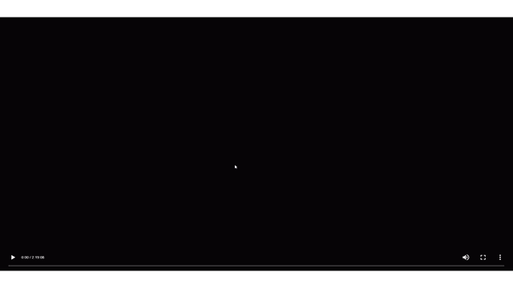

# 🎬 Zenith Movies (Ad-Free Scraper)

A simple movie streaming frontend that pulls video sources using scripts originally based on Vidlink. This version removes ads and provides a clean, minimal playback experience.

## 🚀 Features

* 🎥 Stream movies directly in-browser
* ⚡ Fast loading using HLS streams
* 🚫 No ads (cleaned version of original scripts)
* 🌐 Deployed easily with Netlify or Vercel
* 🔗 Simple URL-based playback system

## 🧠 How It Works

This project uses a scraping/proxy approach to retrieve video streams and display them in a native HTML5 player.

Example:

```
https://your-site.netlify.app/?id=550
```

* `id` = Movie ID (typically from TMDB or similar source)
* The app fetches and injects the stream into a video player
* Playback is handled using HLS
* The custom player overlay supports toggled captions when subtitle/caption tracks are present

## 📁 Project Structure

```
/
├── index.html              # Main frontend and API scrape bootstrap
├── player.css              # Custom player overlay styles
├── player.js               # Custom player overlay controls
├── netlify.toml            # Netlify build, function assets, and API rewrites
├── /netlify/functions/api.js # Netlify serverless API + HLS proxy
├── /netlify/functions/script.js # Netlify API runtime helper
└── /api                    # Vercel serverless API and assets
```


## 🧩 Replacing `index.html`

You do **not** have to keep the included `index.html`. You can replace it with your own page as long as you keep the `/api` endpoint plus the player assets. Include `hls.js`, Lucide, `player.css`, and `player.js`, then call `StreamPlayer.load(streamUrl, options)` after your page gets a stream URL from `/api?id=...`.

Minimal example:

```html
<link rel="stylesheet" href="/player.css">
<script src="https://cdn.jsdelivr.net/npm/hls.js@latest/dist/hls.min.js"></script>
<script src="https://unpkg.com/lucide@latest"></script>
<script src="/player.js"></script>

<div id="player"><video id="v" autoplay playsinline></video></div>

<script>
fetch('/api?id=358651')
  .then((res) => res.json())
  .then((data) => StreamPlayer.load(data.url, { id: '358651' }));
</script>
```

For TV pages, pass `season` and `episode` so the Next Episode button can build the next URL:

```js
StreamPlayer.load(data.url, { id: '456', season: '1', episode: '1' });
```

## 🛠️ Deployment (Netlify)

1. Clone or fork this repo
2. Go to https://app.netlify.com
3. Click **"Add new site"** → **"Import an existing project"**
4. Import your repo
5. Keep the publish directory as the repo root (`.`) and leave the build command empty
6. Deploy

The included `netlify.toml` routes `/api` requests to the Netlify Function at `/.netlify/functions/api`, so the frontend can keep using the same `/api?id=...` and `/api?url=...` paths. Netlify also bundles the required function assets listed in `netlify.toml`.

## 🛠️ Deployment (Vercel)

The existing `vercel.json` still supports Vercel deployments by rewriting `/api` to `api/index.js`.

## ⚠️ Important Notes

* This project is for **educational purposes only**
* Streaming copyrighted content without permission may violate laws in your country
* The original scripts were modified to remove ads, but credit belongs to their respective creators

## 📌 Usage

Just open:

```
https://your-netlify-url.netlify.app/?id=MOVIE_ID
```

That’s it. No accounts, no UI clutter — just press play.

## 💡 Future Improvements

* Playback quality selector
* TV / remote-friendly controls
* Better error handling

---

## ⭐ Support

If you like this project, consider giving it a star ⭐ on GitHub!
